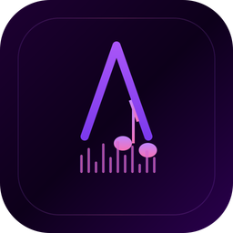
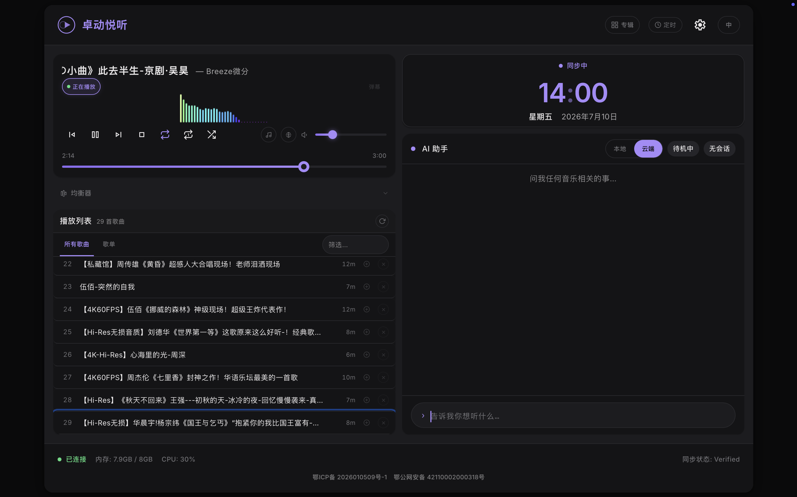
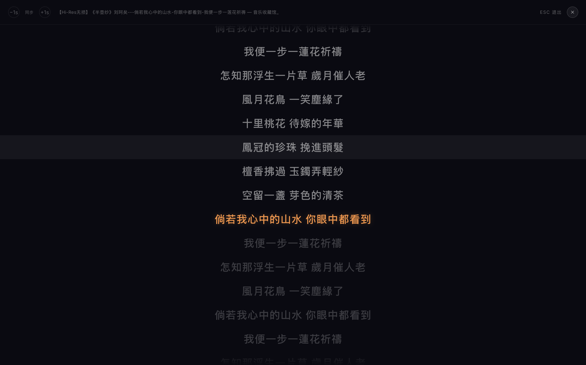
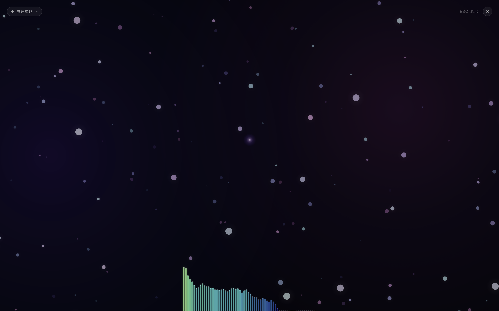

<div align="center">
  

  **🎵 卓动悦听** — AI Agent 驱动的全功能音频播放器（支持语音控制、听歌识曲）

  
  
  
  

  **本地曲库 + B站云端 · AI 语音交互 · Tauri 桌面端**
</div>

---

## ✨ 功能一览

### 🎶 播放核心
| 功能 | 说明 |
|------|------|
| **本地曲库** | 自动扫描本地 MP3，按标签/文件名智能解析（标题、作者、日期、BV号） |
| **B站云端** | AI 搜索 B站视频 → 一键转音频 → 自动加入曲库 |
| **AI Agent 交互** | 自然语言点歌，AI 理解意图并执行（搜索、推荐、切换） |
| **多格式支持** | MP3 / FLAC / WAV / M4A / OGG，Flac 标签自动提取 |

### 🎨 播放体验
| 功能 | 说明 |
|------|------|
| **均衡器 (Equalizer)** | 10 段均衡器，内置流行/摇滚/古典/人声等预设 |
| **歌词联动** | 自动匹配 LRC 歌词，点击时间轴跳转 |
| **弹幕叠加** | B站来源音频同步显示原视频弹幕（DanmakuOverlay） |
| **专辑视图** | 按专辑封面网格展示，点击即播 |
| **全屏沉浸** | 可视化频谱全屏模式，ESC 退出 |
| **赛博氛围** | Ambient 背景粒子 + 实时系统状态面板 |

### 🛠️ 实用工具
| 功能 | 说明 |
|------|------|
| **睡眠定时** | 自定义时长后自动停止播放 |
| **语音控制 🎤** | 使用麦克风说「下一首」「暂停」「播放 XXX」，阿里云 NLS 语音识别 |
| **听歌识曲 🎵** | 点击音符按钮录音 10-15 秒，自动识别：本地指纹匹配（chromaprint）或 ACRCloud 云端百万曲库 |
| **快捷操作** | 键盘快捷键（空格 播放/暂停，← → 切歌，↑ ↓ 音量） |
| **Media Session** | macOS 锁屏/控制中心集成 |
| **歌单管理** | 新建/重命名/删除歌单，收藏功能 |
| **播放历史** | 自动记录，随时回溯 |
| **双语言** | 简体中文 / English 一键切换 |

### 🖥️ 桌面端（Tauri）
| 功能 | 说明 |
|------|------|
| **原生窗口** | macOS App（.app / .dmg），独立菜单栏 |
| **系统托盘** | 后台运行，快速唤醒 |
| **开机自启** | macOS 登录时自动启动 |
| **菜单栏图标** | 常驻菜单栏，快速控制 |
| **配置持久化** | API Key / 音乐目录 通过设置界面管理，本地 JSON 持久化 |

---

## 📸 截图







---

## 🏗️ 技术栈

| 层 | 技术 |
|---|------|
| 框架 | Next.js 16 (App Router) |
| 前端 | React 19 + TypeScript 5 |
| 样式 | Tailwind CSS 4 + CSS 自定义变量 |
| AI | OpenAI SDK（兼容 DeepSeek / Agnes / Anthropic 等） |
| 桌面端 | Tauri v2（Rust） |
| 音频转换 | bv2mp3 |

---

## 🚀 快速开始

### 前置条件

- **Node.js >= 20**
- **pnpm**（推荐）或 npm
- **AI API Key**（任一即可）
  - [DeepSeek](https://platform.deepseek.com/)（推荐，性价比高）
  - [Agnes AI](https://apihub.agnes-ai.com/)

### Web 模式（开发调试）

```bash
# 1. 安装依赖
pnpm install

# 2. 配置环境变量
cp .env.example .env.local

# 编辑 .env.local，填入 API Key：
# ANTHROPIC_API_KEY=sk-your-key-here
# ANTHROPIC_MODEL=deepseek-chat（或其他模型名）
# ANTHROPIC_BASE_URL=https://api.deepseek.com （或其他服务商地址）

# 3. 启动开发服务器
pnpm dev
```

打开 **http://localhost:3000** 即可使用。

### 桌面端（Tauri App）

```bash
# 开发模式（带热更新）
pnpm tauri:dev

# 打包为 .app / .dmg
pnpm tauri:build
```

> 首次运行 Tauri 需要安装 [Rust 工具链](https://www.rust-lang.org/tools/install)。

### 配置 API Key（Tauri 桌面端）

在设置界面（⚙️）中直接填入 API Key，无需手动编辑 `.env.local`。

---

## 📂 项目结构

```
ZDMusic/
├── app/
│   ├── api/              # 后端 API 路由
│   │   ├── chat/         # AI Agent SSE 流式接口
│   │   ├── bili/         # B站搜索 & 弹幕代理
│   │   ├── search/       # 本地曲库搜索
│   │   ├── tracks/       # 音频文件服务 & 扫描
│   │   └── config/       # 配置读取 API
│   ├── components/       # UI 组件（Atomic Design）
│   │   ├── atoms/        # 基础组件（Logo, ModeSwitch, Lyrics...）
│   │   ├── molecules/    # 组合组件（Equalizer, SleepTimer, SettingsDialog...）
│   │   └── organisms/    # 页面级组件（Player, Playlist, AlbumGrid, AgentChat...）
│   ├── context/          # React Context（Player / Agent / Mode / Danmaku）
│   ├── hooks/            # 自定义 Hooks
│   │   ├── useAudioPlayer.ts    # 音频播放核心
│   │   ├── useEqualizer.ts      # 均衡器状态
│   │   ├── useSleepTimer.ts     # 睡眠定时
│   │   ├── useLyrics.ts         # 歌词加载
│   │   ├── useKeyboardShortcuts.ts
│   │   ├── useMediaSession.ts   # macOS 控制中心集成
│   │   ├── useAudioVisualizer.ts
│   │   ├── useSSE.ts
│   │   └── useClock.ts
│   ├── lib/              # 共享业务逻辑
│   │   ├── bili.ts       # B站 API
│   │   ├── tracks.ts     # 曲库扫描 & 解析
│   │   ├── config.ts     # 配置读取（环境变量 / 文件）
│   │   ├── i18n.ts       # 国际化
│   │   ├── types.ts      # 类型定义
│   │   ├── tags.ts       # 音频标签解析
│   │   ├── playlists-store.ts
│   │   └── play-history.ts
│   ├── layout.tsx
│   └── page.tsx          # 主页面
├── src-tauri/            # Tauri Rust 层
│   ├── src/
│   │   ├── lib.rs        # Tauri 命令（start/stop server, config 路径）
│   │   └── main.rs       # 入口
│   ├── Cargo.toml
│   ├── tauri.conf.json
│   └── capabilities/     # Tauri v2 ACL 配置
├── scripts/              # 构建工具脚本
│   ├── prepare-standalone.mjs  # Next.js standalone 产物清理
│   ├── generate-icons.mjs      # SVG → ICNS/ICO 生成
│   ├── generate-icons.sh
│   ├── build.sh
│   └── wrap-bv2mp3.mjs
├── public/               # 静态资源 & 图标
│   └── icons/            # 应用图标
├── design/               # 设计规范文档
├── docs/screenshots/     # 应用截图
├── .env.example
├── package.json
└── tsconfig.json
```

---

## ⌨️ 键盘快捷键

| 快捷键 | 功能 |
|--------|------|
| `Space` | 播放 / 暂停 |
| `←` `→` | 上一首 / 下一首 |
| `↑` `↓` | 音量增减 |
| `M` | 静音切换 |
| `Escape` | 退出全屏 / 歌词模式 |

> macOS 控制中心（Media Session API）也支持锁屏控制。

---

## 🖥️ 桌面端构建说明

### macOS 打包

```bash
pnpm tauri:build
```

构建产物：
- `src-tauri/target/release/bundle/dmg/卓动悦听.dmg`（安装包，~18MB）
- `src-tauri/target/release/bundle/macos/卓动悦听.app`（应用，~50MB）

### 构建流程

1. `npm run build` → Next.js 构建
2. `node scripts/prepare-standalone.mjs` → 清理 standalone 产物（去掉 node_modules 追踪的无关文件，控制体积）
3. Tauri 打包为原生 `.app`

---

## 🔧 配置

### 环境变量（Web 模式）

| 变量 | 说明 | 默认值 |
|------|------|--------|
| `ANTHROPIC_API_KEY` | AI API Key | — |
| `ANTHROPIC_MODEL` | AI 模型名 | `deepseek-chat` |
| `ANTHROPIC_BASE_URL` | API 端点地址 | `https://api.deepseek.com` |
| `MUSIC_DIR` | 本地音乐目录 | `~/Documents/bili` |
| `MUSIC_RECOGNITION_MODE` | 听歌识曲模式：`local` 或 `cloud` | `local` |
| `ACRCLOUD_ACCESS_KEY` | ACRCloud 听歌识曲密钥 | — |
| `ACRCLOUD_ACCESS_SECRET` | ACRCloud 密钥 Secret | — |
| `ACRCLOUD_HOST` | ACRCloud 服务地址 | `identify-china.acrcloud.cn` |
| `ALIYUN_NLS_APP_KEY` | 阿里云 NLS 语音识别 AppKey | — |
| `ALIYUN_ACCESS_KEY_ID` | 阿里云 RAM AccessKey | — |
| `ALIYUN_ACCESS_KEY_SECRET` | 阿里云 RAM Secret | — |
| `BILIBILI_COOKIE_SESSDATA` | B站 Cookie 提升稳定性 | — |

### 配置文件（Tauri 桌面端）

路径：`~/.zdmusic/config.json`

由设置界面（⚙️）自动读写，格式：

```json
{
  "env_vars": {
    "ANTHROPIC_API_KEY": "sk-xxx",
    "ANTHROPIC_MODEL": "deepseek-chat",
    "ANTHROPIC_BASE_URL": "https://api.deepseek.com",
    "MUSIC_DIR": "/path/to/music",
    "MUSIC_RECOGNITION_MODE": "local",
    "ACRCLOUD_ACCESS_KEY": "***",
    "ACRCLOUD_ACCESS_SECRET": "***",
    "ALIYUN_NLS_APP_KEY": "***",
    "ALIYUN_ACCESS_KEY_ID": "***",
    "ALIYUN_ACCESS_KEY_SECRET": "***"
  }
}
```

---

## 🎤 语音控制

支持通过麦克风进行语音指令控制。

### 用法

1. 在设置页面（⚙️）配置阿里云 NLS 密钥：
   - 访问 [nls.console.aliyun.com](https://nls.console.aliyun.com/) 创建项目获取 AppKey
   - RAM 用户授权 `AliyunNLSSpeechRecognizer` 权限获取 AccessKey
2. 点击播放器底部的 🎤 按钮
3. 说出指令（支持中英文）：
   - **播放控制**：下一首 / 上一首 / 暂停 / 播放
   - **点歌**：播放 XXX
   - **音量**：大声点 / 小声点

> 语音识别使用的是阿里云 NLS 实时语音识别（基于 WebSocket MediaRecorder）。

## 🎵 听歌识曲

支持本地指纹匹配和云端 ACRCloud 识别两种模式。

### 本地模式（默认）

```bash
# 1. 安装 fpcalc（chromaprint）
brew install chromaprint

# 2. 建立指纹索引（首次运行）
curl -X POST http://localhost:3000/api/tracks/build-fingerprints

# 3. 点击播放器底部的 🎵 按钮，录音 10-15 秒
```

- 识别结果会弹出歌曲卡片，点击「播放」直接跳转到本地文件
- **指纹阈值 0.6**：适合大部分场景的匹配精度
- 指纹库自动增量更新：重新调用 `/api/tracks/build-fingerprints` 只处理新增/变更文件

### 云端模式（ACRCloud）

```bash
# 1. 在 https://console.acrcloud.cn/ 注册获取 Key/Secret
# 2. 在设置页面填入密钥，模式切换为「云端」
# 3. 🎵 按钮 → 录音 → ACRCloud 识别
```

- 曲库覆盖广（百万级），轻松识别冷门歌曲
- 通过扬声器播放也能识别（专为 mic 录音优化）

### 模式切换

在设置页面（⚙️）→ 听歌识曲 → 选择「本地」或「云端」即可，无需重启。

---

## 📋 平台支持

| 平台 | 支持情况 |
|------|---------|
| macOS (Intel / Apple Silicon) | ✅ 完全支持（Web + Tauri 桌面端） |
| Linux | ✅ Web 模式支持 |
| Windows | ⚠️ Web 模式支持，Tauri 桌面端需验证 |

---

## 🐾 关于项目
- **起源**：一个 AI Agent 驱动的 B站音频播放器实验项目
- **定位**：本地优先、AI 增强、桌面友好的个人音乐播放器
- **许可证**：[个人非商业用途许可协议](LICENSE) — 个人免费使用，商业用途需联系作者授权
- **项目仓库**：https://github.com/657793814/ZDMusic
- **作者邮箱**：657793814@qq.com
